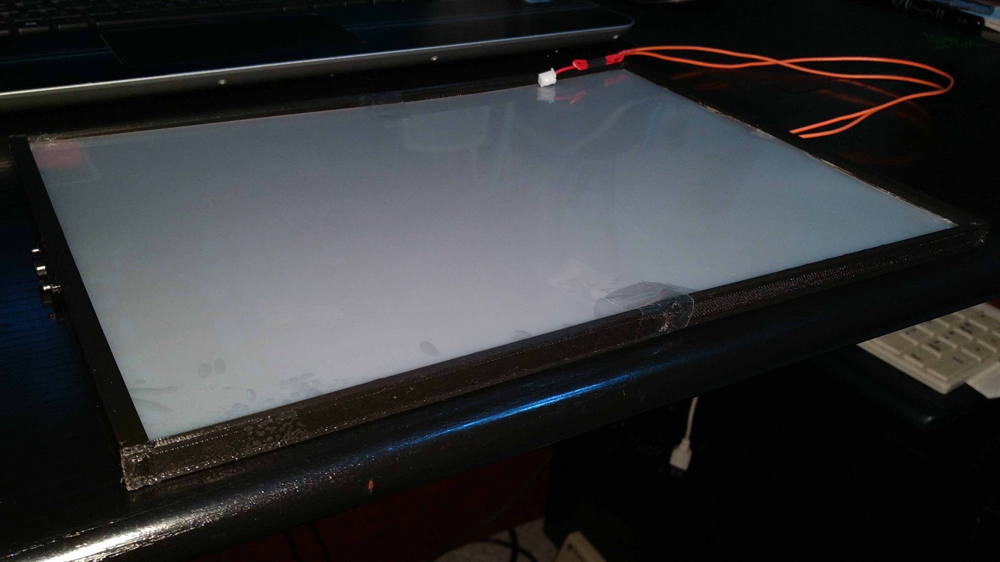
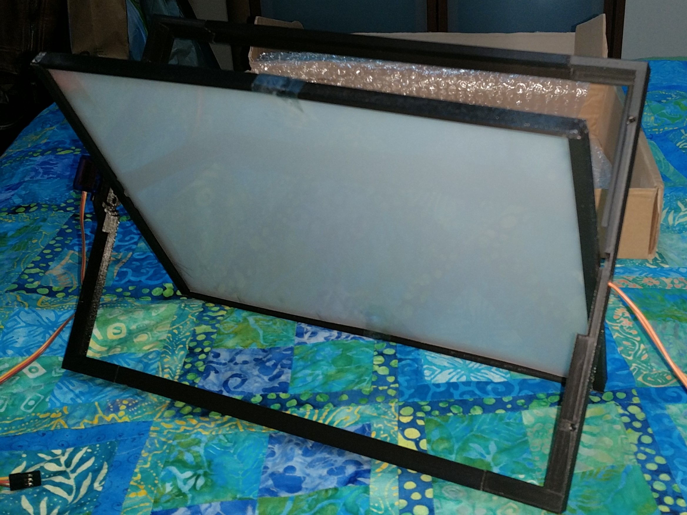
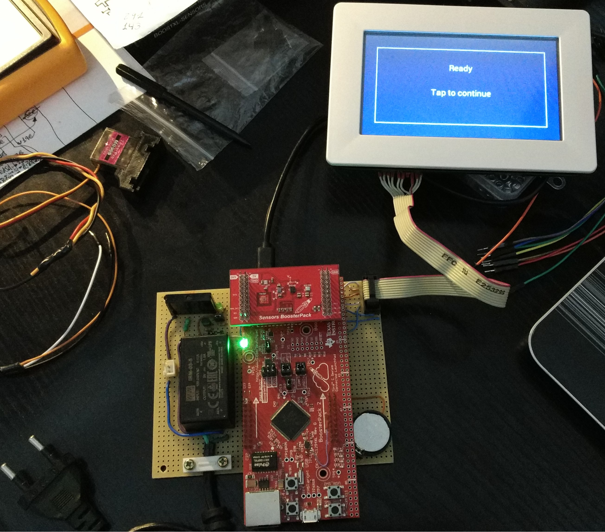

# All in 2 Window

## 📃 Description
The aim of this project was to develop an energy-saving system for buildings based on the automation of two concepts: window opening and window transparency. A motor is used for each window to open, controlled by the system, and an ESG (Electro Switchable Glass) is used to control transparency.

<p align="center">
	
	
</p>

In the specific case of the POC developed, a system consisting of a single window was presented, with a servomotor for its opening. The "glass" is composed of a methacrylate and an ESG-type film (specifically PDLC) that adheres to the methacrylate. The film is controlled so that it varies between a transparent state and an opaque state in which it scatters 98% of the incident light radiation.

<p align="center">
	
	
</p>

The environmental variables to be "controlled" (as much as possible) throughout the day, are measured using the Bosch BME280 environmental sensor (two used, one indoor and one outdoor) and the Texas Instruments OPT3001 light radiation sensor (indoor).

<p align="center">
	
</p>

The system includes a control interface for system parameters and configuration using a VM800B50 touchscreen (FTDI chip), as well as various interface-specific settings (language, brightness, calibration, etc.), along with display modes for environmental variables and their evolution over time, manual window control (opening and transparency), and date and time display using the microcontroller's internal RTC.

<p align="center">
	
	
</p>

<p align="center">
	
	
</p>

Finally, the screen will dim when the user is inactive and a screensaver will display only the time, date, and system language. The system is controlled by the TM4C1294NCPDT microcontroller.

This project was developed (back in 2018) on Code Composer Studio (CCS) for TM4C1294XL Connected Launchpad. To compile and flash the project to the board, some configurations are needed.

## 📁 Files of the project

```
Source and project files that are setted instantly with the repo:
/all-in-2-window
│── .ccsproject
│── .cproject
|── .project
│── main.c

Source files to be linked from TivaWare:
/TIVAWARE_INSTALL
│── driverlib\ccs\Debug\driverlib.lib
│── utils\ustdlib.c
│── utils\uartstdio.c

Header/Source files to be included through include path in CCS:
/libraries
│── iofuncs.h
│── HAL_I2C.h
│── FT800_TIVA2.h
│── FT800_TIVA2.c
│── sensorlib2.h
│── sensorlib2.lib
```

---
## 🎫 Prerequisites

**TivaWare** has to be installed on the computer, default path is C:\\\ti

TivaWare url: https://www.ti.com/tool/download/SW-TM4C/2.1.4.178

[Select → **SW-EK-TM4C1294XL-2.1.4.178.exe  — 80646 K**]
## ⚙️ Configuration on Code Composer Studio

### 1️⃣ Project Import on Code Composer Studio

1. **Open CCS** and select a **workspace**.
2. Go to **File → Import → Code Composer Studio → CCS Projects**.
3. Select **"Select search-directory"** and choose the folder where the repo was cloned.
4. Check the project is on the list and click **Finish**.

### 2️⃣ Configure path variable `TIVAWARE_INSTALL`

This project uses **TivaWare** and it needs the `TIVAWARE_INSTALL` path variable configured on CCS workspace.

#### 📌 How to add `TIVAWARE_INSTALL` path variable to CCS workspace:

1. Go to **Window → Preferences → General → Workspace → Linked Resources**.
2. At **Path Variables**, click on **New\...**.
3. Fill in **Name** with: `TIVAWARE_INSTALL`.
4. Fill in **Value** with the TivaWare installation path, for instance:
   ```
   C:/ti/TivaWare_C_Series-2.1.4.178
   ```
5. Click on **Apply and Close** to save the changes.

### 3️⃣ Check include paths and linked driverlib.lib

1. Open project's **Properties** 
2. Go to **Build → ARM Compiler → Include Options**.
3. Make sure there is a path with **${TIVAWARE_INSTALL}** and another with **${PROJECT_LOC}\libraries**.
4. Click **Apply and Close**.
5. Finally make sure file driverlib.lib is correctly linked to **TIVAWARE_INSTALL\driverlib\ccs\Debug\driverlib.lib** whatever your **TivaWare** installation path is.


## Notes
- To make this project fully operable (date-time operation without maintaining VCC pins' power supply, but using a coin cell instead) a hardware modification in the TM4C1294XL Connected Launchpad is required:
  
  The R39 resistor must be removed to separate MCU's VBAT pin from 3V3 power supply net.
  A 1P pin header can be soldered on TP11 to access VBAT pin.

- This project was tested under **Code Composer Studio 8.2.0.00007** and **TivaWare 2.1.4.178**
- Although this project is under GPL-3.0, inside libraries folder there are files under BSD-3 licensing control (still compatible).